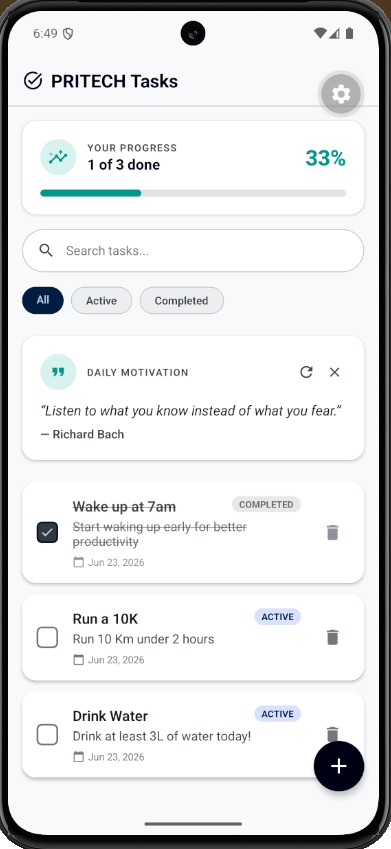
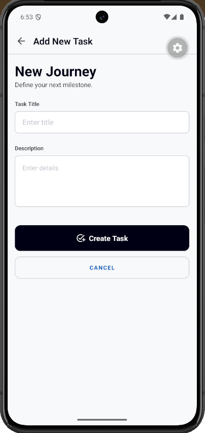
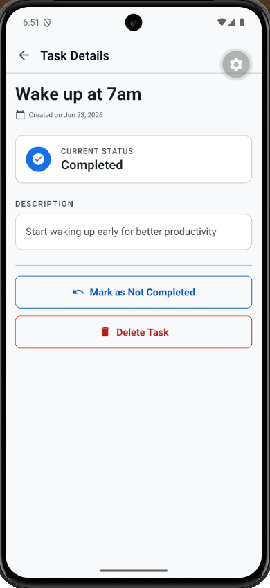

# PRITECH Tasks

A simple task manager built with React Native (Expo). Create, complete, and
delete personal tasks — with search, filtering, local persistence, and a clean
animated UI.

## Screenshots

| Home                                                     | Add Task                                                     | Task Details                                                         |
| -------------------------------------------------------- | ------------------------------------------------------------ | -------------------------------------------------------------------- |
|  |  |  |

## Features

- **Task list** with title, description, status, and created date
- **Add task** with input validation (title required)
- **Mark complete / not complete** (tap the checkbox or use the details screen)
- **Delete task** (swipe-free: trash icon, or the details screen with a confirm)
- **Task details** screen (opens as a modal)
- **Search** tasks by title/description
- **Filter** by All / Active / Completed
- **Local persistence** with AsyncStorage — your tasks survive an app restart
- **Public API** — a live **Daily Motivation** card fetches a random quote from
  [ZenQuotes](https://zenquotes.io) (tap refresh for a new one)
- **Progress card** + smooth list animations (Reanimated)

## Tech stack

- Expo SDK 56 / React Native, TypeScript
- React Navigation (native-stack) for screen navigation
- AsyncStorage for persistence
- Reanimated for animations
- Context + a custom `useTasks` hook for state

## Project structure

```
App.tsx                  # providers (safe-area, tasks, navigation)
src/
├── api/                 # public API calls (motivational quotes)
├── components/
│   ├── common/          # generic, reusable (Badge, EmptyState)
│   ├── layout/          # app shell (Layout, AppBar, Fab, ScreenHeader)
│   └── tasks/           # task UI (TaskCard, TaskList, SearchBar, ...)
├── constants/           # colors + theme tokens
├── context/             # TasksProvider (state + load/save)
├── hooks/               # useTasks
├── navigation/          # stack navigator + route types
├── screens/             # TaskList, AddTask, TaskDetails
├── storage/             # AsyncStorage read/write
├── types/               # Task type
└── utils/               # date formatting
```

## Getting started

### Prerequisites

- [Node.js](https://nodejs.org/) (LTS)
- An Android emulator (via Android Studio) or a physical device
- Internet connection (to load the Daily Motivation quote)

### 1. Install dependencies

```bash
npm install
```

### 2. Run the app

**Android:**

```bash
npm run android
```

**iOS (macOS only):**

```bash
npm run ios
```

This starts the Metro bundler and opens the app on your emulator/device.

> Alternatively, run `npm start` and press `a` (Android) or `i` (iOS) in the
> terminal.

### 3. Use it

- Tap **+** to add a task, the **checkbox** to complete it, a **card** to open
  details, and the **trash icon** to delete.
- Everything you do is saved locally and restored next time you open the app.

## Troubleshooting

- **"Unable to resolve …" or a stale screen after pulling changes** — restart
  Metro with a clean cache: `npx expo start -c`.
- **Want a clean slate** — clear the app's stored data (emulator: App info →
  Storage → Clear storage) and relaunch to start with an empty task list.
